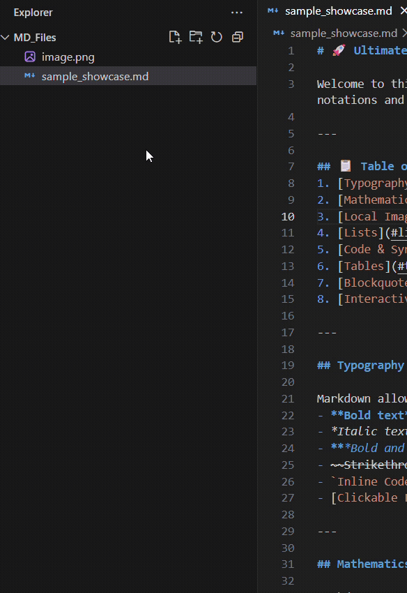

  

# MD Previewer

A high-performance, structurally optimized Markdown previewer for Visual Studio Code.

**MD Previewer** provides a seamless, GitLab-style preview environment for Markdown documents. Engineered for speed and precision, it combines an advanced rendering pipeline with native-feeling UI components to deliver a robust documentation workflow.

---

## Features

### Advanced UI & Navigation
- **Collapsible Minimap Outline**: Features a right-docked, glassmorphic Table of Contents panel (`backdrop-filter: blur`) that dynamically adapts to active VS Code themes. It supports persistent state storage, interactive scroll-spy highlighting, and responsive document reflow.
- **Bi-Directional Scroll Synchronization**: Implements decoupled, dual-throttled scroll synchronization. By utilizing a dynamic scroll-driven debouncer, the extension completely eliminates IPC echo loops, ensuring perfectly stable and smooth scrolling between the editor and the preview window.

### Rich Markdown Rendering
- **Diagrams & Mathematics**: Natively supports Mermaid.js for complex diagrams (flowcharts, sequence, Gantt) and KaTeX for high-fidelity LaTeX block and inline equations.
- **GitLab-Flavored Elements**: Renders standard GitLab alert blocks (Note, Warning, Caution), task lists, and emojis.
- **Media Integration**: Automatically parses and embeds responsive iframe cards for YouTube and Vimeo links.
- **Intelligent Path Resolution**: Supports relative local file paths, including images with spaces, and automatically resolves internal file links to open directly within the VS Code workspace.

### Publication-Grade PDF Export
- **Headless Chromium Generation**: Generates clean, publication-ready PDF documents natively using headless Chrome/Chromium without requiring external web services.
- **Optimized Print Layouts**: The CSS engine automatically strips all UI overlays, minimization tabs, and minimap boundaries prior to generation, ensuring a clean print structure. Default browser headers and footers (local file paths) are completely disabled.

---

## Architecture & Performance

The extension is designed to maintain a near-zero footprint on the extension host:

- **Debounced IPC Bridge**: Real-time document updates are batched and debounced on the host side (150ms limit), preventing CPU thrashing during high-speed typing.
- **True DOM Diffing**: Utilizes `morphdom` in the client webview to surgically patch the HTML tree. This eliminates destructive `innerHTML` wipes, entirely preserving the state of active embedded elements (such as playing videos) during live document updates.
- **Asynchronous Asset Loading**: Heavy client-side libraries (Highlight.js, Mermaid, KaTeX) are loaded asynchronously, keeping the initial render and memory overhead extremely low (total bundle ~1.1 MiB).

---

## Usage

You can launch MD Previewer using either of the following methods:

### 1. Editor Title Bar
Open any `.md` file and click the **View Preview** icon located in the top-right corner of the active editor.

### 2. Context Menu
Right-click any `.md` file in the VS Code File Explorer and select **View Preview**.

---

## Configuration

You can customize the extension via your `settings.json` file. 

| Setting | Type | Description |
|---------|------|-------------|
| `mdViewer.chromePath` | `string` | Optional absolute path to your local Chrome or Chromium executable used for PDF generation. The extension will attempt to auto-detect this path if left empty. |

---

## License

Distributed under the MIT License. See `LICENSE` for more information.

---

**Developed by Allwin S Antony**
