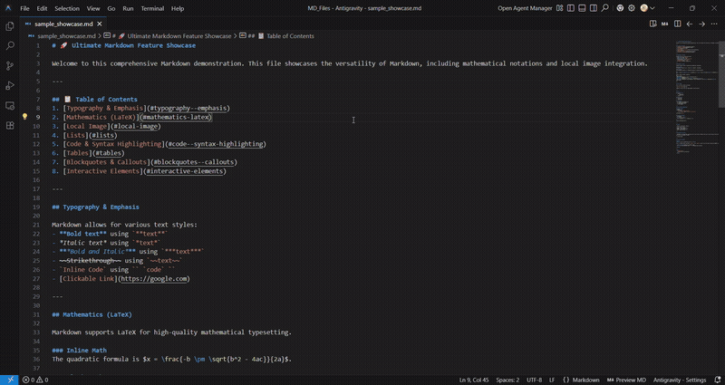

# MD Previewer 🚀

A high-performance, polished Markdown previewer for Visual Studio Code.

**MD Previewer** provides a seamless, GitLab-style preview experience for your Markdown documents. It’s packed with modern features, fully optimized for speed, and designed to look premium right out of the box.

## 🛠️ How to Use

MD Previewer can be launched in two convenient ways:

### 1. Editor Title Bar Button
Open any Markdown file and click the **View Preview** icon in the top-right corner of the editor.

### 2. Explorer Context Menu
Right-click any `.md` file in the File Explorer and select **View Preview**.

---

## ✨ Key Features

- **🚀 Real-time Live Preview**: Your changes are rendered instantly as you type.
- **📊 Mermaid Diagrams**: Support for flowcharts, sequence diagrams, and more.
- **🧪 Math Formulas (KaTeX)**: Beautiful LaTeX math rendering for both inline and block equations.
- **📂 Smart Navigation**:
  - **Internal Anchors**: Smooth scrolling for table of contents and heading links.
  - **File Links**: Clicking a relative link (e.g., `[Setup](setup.md)`) opens that file in VS Code automatically.
- **🖼️ Intelligent Image Handling**: Support for relative paths and local images, including those with spaces in filenames.
- **🎨 Syntax Highlighting**: Premium code block styling with `Highlight.js`.
- **✅ Modern MD Support**: Task lists, emojis, and GitLab-style alert blocks.

---

## ⚡ Performance First

This extension is built for efficiency:

- **Zero-Lag Rendering**: Uses a lightning-fast `postMessage` architecture to update content without flickering.
- **Client-Side Heavy Lifting**: Mermaid and KaTeX are rendered directly in the webview browser, keeping the VS Code extension host responsive.
- **Smart Caching**: Rendered HTML and image lookups are cached to minimize CPU and disk usage.
- **Ultra Lightweight**: The compiled extension bundle is roughly **1.1 MiB**.

---

## 📜 License

Distributed under the **MIT License**. See `LICENSE` for more information.

---

Created by **Allwin S Antony**
